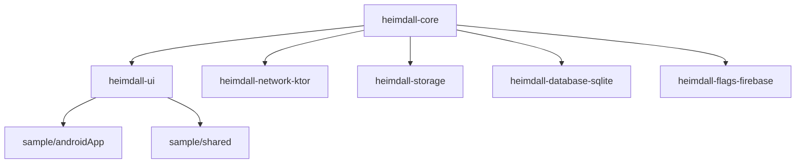

# Architecture

## Module graph

`heimdall-core-noop`, `heimdall-ui-noop`, `heimdall-network-ktor-noop`, `heimdall-storage-noop`,
`heimdall-database-sqlite-noop`, and `heimdall-flags-firebase-noop` are not shown above: they are
drop-in replacements for their real counterparts in a release build, not additional dependents —
see `docs/release-builds.md`. Each depends only on its own real module's `-noop` core counterpart
(e.g. `heimdall-storage-noop` depends on `heimdall-core-noop`), never on the real modules.

- **`heimdall-core`**: no UI, no Compose dependency. Shake detection (`ShakeDetector` shared +
  `AndroidShakeListener`/`IosShakeListener` per platform) and Heimdall's own
  on-disk store (`HeimdallDatabase`, an `androidx.sqlite` `BundledSQLiteDriver` connection guarded
  by a mutex) holding `NetworkStore`/`LogStore`/`CrashStore`/`StorageStore`/`DatabaseStore`/
  `FlagStore`/`EventStore`, all reachable through the `Heimdall` singleton. Kept UI-free so a future consuming
  app could reuse this layer without pulling in Compose.
- **`heimdall-network-ktor`**: a Ktor `HttpClient` plugin that reports into `Heimdall.network`.
  Depends only on `heimdall-core` + Ktor, not on `heimdall-ui`.
- **`heimdall-storage`**: `attachDataStore` plus SharedPreferences/UserDefaults/Keystore/Keychain
  discovery. See `docs/plugins/storage.md`.
- **`heimdall-database-sqlite`**: `SqliteFileInspector`, a `DatabaseInspector` that reads any
  on-disk SQLite file (Room, SQLDelight, raw). See `docs/plugins/database.md`.
- **`heimdall-flags-firebase`** (Android): `FirebaseRemoteConfig.attachToHeimdall()`, a
  `FlagProvider` that discovers Remote Config keys.
- **`heimdall-ui`**: Compose Multiplatform. `HeimdallBubble`, `HeimdallPanel`,
  `HeimdallOverlay` (the composable a consumer wraps their content in).
- Collector modules are each their own module so a consumer only pulls in what they use. Logs and
  crash capture have no separate module: they're plain `Heimdall.log`/`Heimdall.recordCrash` calls
  in `heimdall-core`, with no framework to adapt to.

## Persistence and sessions

Heimdall keeps its own SQLite database (`HeimdallDatabase`), entirely separate from the app's —
never the app's own data directory, so a consumer's backup/restore of their own data can't catch
Heimdall's captures by accident. `Heimdall.install(context)` opens it and starts a new **session**
(one process run, from start to process death — backgrounding and resuming later is still the
same session). Every record is tagged with the session it happened in, so the panel can show one
run's data without earlier or later runs mixed in, and a run that crashed is flagged.

Each store keeps a capped, in-memory, newest-first copy of the **current** session as a
`StateFlow`, so the panel updates live without polling the database; browsing a past session reads
straight from disk instead. Recording happens whether or not the panel/overlay is open or has
ever been shown — the store's `record`/`publish` call is what writes, not anything overlay-related.

Retention: history older than **24 hours** (`HeimdallDatabase.RETENTION_MILLIS`) is deleted at
startup and at most once an hour while the app runs (`pruneIfDue`). A launch older than 24 hours
stays while it still has newer rows (a process left running across days). Independently, only the
most recent **3 launches** (`SessionRepository.MAX_RETAINED_SESSIONS`) are ever kept — every new
`Heimdall.install(...)` prunes anything beyond that, regardless of the 24-hour window, so the
session picker stays a short, memorable list. Per-session caps (`HeimdallDatabase.MAX_*`)
additionally drop the oldest rows in a launch once exceeded, as a disk safety net. Long-term crash
history is out of scope — use a crash reporter such as Firebase Crashlytics for that.

### History vs. live state

Only **history** is persisted and split by session: network calls (`NetworkStore`), logs
(`LogStore`), crashes (`CrashStore`) and app-reported timeline events (`EventStore`). Events can
carry an optional screen name and bounded string attributes, so a consumer can correlate an
action with the screen that reported it without Heimdall guessing from navigation or URLs.

**Live state** is never persisted or split by session: storage sources (`StorageStore` —
DataStore, SharedPreferences, UserDefaults), the app's own databases (`DatabaseStore`) and flag
overrides (`FlagStore`). They answer "what is it right now"; a copy from a previous run would
just be a stale, misleading version of the same thing. `StorageStore` and `DatabaseStore` hold
in-memory `mutableMapOf`/`StateFlow` state only (see their source).

## Integration model

Different per collector, decided per docs.instructions.md before building each one:
- **Overlay**: consumer wraps their root composable in `HeimdallOverlay { }` (explicit, no magic).
- **Platform hooks**: `Heimdall.install(context)` installs Android uncaught-crash capture
  automatically. The UI host still owns shake-to-recall because core must not depend on the UI
  module. There is deliberately no automatic frame/jank monitoring — see `docs/TODO.md` for why.
- **Screen attribution**: consumer calls `Heimdall.setCurrentScreen(...)`, uses
  `Heimdall.screen("Name") { ... }` for a scoped block, or passes an explicit screen name to
  `Heimdall.event(...)`. Heimdall does not infer screen ownership automatically.
- **Performance**: consumer wraps work in `Heimdall.measure("name") { ... }`. The bounded live
  `PerformanceStore` feeds Overview, and each measurement is also written as a timeline event.
  Automatic Compose recomposition counting is a separate integration and is not inferred by this
  API.
- **Network** (implemented): a Ktor `HttpClient` plugin the consumer installs on their own
  client — Heimdall never owns the client.
- **Database** (implemented): consumer passes their existing driver/database instance in —
  Heimdall never creates or migrates it. The `DatabaseInspector` contract exposes a bounded
  snapshot and read-only query function; `DatabaseStore.attach(...)` registers it and refreshes
  it when the Database tab opens.
- **Flags**: a decorator around the consumer's existing flag/entitlement provider, not a
  replacement. Heimdall cannot enumerate arbitrary provider keys safely, so consumers register
  `FlagDefinition` values for the flags they want to inspect, or attach a `FlagCatalog` adapter once
  when the provider can enumerate its keys. An optional restart handler enables the panel's Restart
  app action. The optional `heimdall-flags-firebase` Android module provides
  `FirebaseRemoteConfig.attachToHeimdall()` for automatic key discovery and override-aware reads.

## Open decisions

### 1. Where the overlay lives, especially on iOS

Two options:
- **(a) Wrap the root composable.** What `HeimdallOverlay` does today. Simple, matches
  kmp-inspector's approach. Known limitation: the bubble is hidden behind native sheets/screens
  pushed outside that composable.
- **(b) A separate always-on-top window** (Android: add the bubble view to each Activity's
  decor view via `ActivityLifecycleCallbacks`, no `SYSTEM_ALERT_WINDOW` permission needed. iOS:
  a second `UIWindow` at `.alert` level.) Stays visible over everything, but touch-passthrough
  outside the bubble's own bounds needs to be proven before relying on it.

Decision: (a) is the default on both platforms. An Android decor-view host was tried and removed —
it does not cover Compose `Dialog`/`ModalBottomSheet`/`Popup`, which open in their own windows, so
it added a native layer without fixing the gap. iOS keeps (b) as an opt-in in the sample
(`MainViewControllerWithNativeOverlayWindow()`), not yet run.

### 2. Reuse vs. rewrite

`kmp-inspector` (Apache-2.0) is the closest prior art and worth reading before implementing each
new collector, particularly for its Ktor/Room companion module split and its no-op/dead-code
notes for iOS (`docs/release-builds.md` inherits its warning that Kotlin/Native only strips
unused code when the framework does not `export()` it).
