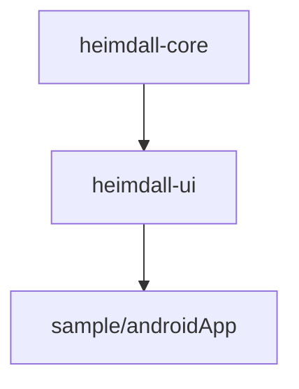

# Architecture

## Module graph

- **`heimdall-core`**: no UI, no Compose dependency. Shake detection (`ShakeDetector` shared +
  `AndroidShakeListener`/`IosShakeListener` per platform) and `OverlayState`. Kept UI-free so a
  future consuming app could reuse the shake/state logic without pulling in Compose.
- **`heimdall-ui`**: Compose Multiplatform. `HeimdallBubble`, `HeimdallPanel`,
  `HeimdallOverlay` (the composable a consumer wraps their content in).
- Collector modules (network/db/storage/logs/flags) do not exist yet — each will be its own
  module so a consumer only pulls in what they use (see prior art: kmp-inspector's
  `library-ktor`/`library-room` split, AELog's per-plugin artifacts).

## Integration model

Different per collector, decided per docs.instructions.md before building each one:
- **Overlay**: consumer wraps their root composable in `HeimdallOverlay { }` (explicit, no magic).
- **Network** (not yet built): a Ktor `HttpClient` plugin the consumer installs on their own
  client — Heimdall never owns the client.
- **Database** (not yet built): consumer passes their existing driver/database instance in —
  Heimdall never creates or migrates it.
- **Flags** (not yet built): a decorator around the consumer's existing flag/entitlement
  provider, not a replacement — see the design discussion that produced this project.

## Open decisions

### 1. Where the overlay lives, especially on iOS

Two options, neither implemented yet:
- **(a) Wrap the root composable.** What `HeimdallOverlay` does today. Simple, matches
  kmp-inspector's approach. Known limitation: the bubble is hidden behind native sheets/screens
  pushed outside that composable.
- **(b) A separate always-on-top window** (Android: add the bubble view to each Activity's
  decor view via `ActivityLifecycleCallbacks`, no `SYSTEM_ALERT_WINDOW` permission needed. iOS:
  a second `UIWindow` at `.alert` level.) Stays visible over everything, but touch-passthrough
  outside the bubble's own bounds needs to be proven before relying on it.

Milestone 1 shipped (a) for Android, since it was enough to prove the bubble/panel/shake
mechanics. (b) is unproven on either platform — prototype before committing collector work on
top of either choice, since collectors don't care which one wins but the bubble/panel code does.

### 2. Reuse vs. rewrite

`kmp-inspector` (Apache-2.0) is the closest prior art and worth reading before implementing each
new collector, particularly for its Ktor/Room companion module split and its no-op/dead-code
notes for iOS (`docs/release-builds.md` inherits its warning that Kotlin/Native only strips
unused code when the framework does not `export()` it).
